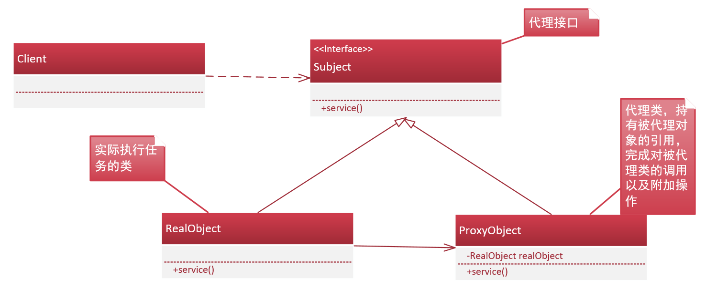

#结构性设计模式--代理模式

####目的 
  为其他对象提供一种代理控制对象的访问权限。
####组成元素
1. 代理接口：定义了实际对象和代理对象之间的共同行为。
2. 被代理对象：实际完成代理接口中定义的行为方法。
3. 代理对象：调用被代理对象完成实际工作，在被代理对象调用之前或者之后可以添加一些与实际对象完成工作无关的操作。
####用途
进行远程代理、Spring中AOP的实现（也即是在实际对象的动作执行前后织入我们需要的操作而不影响主要业务的实现与主要业务完全分离）